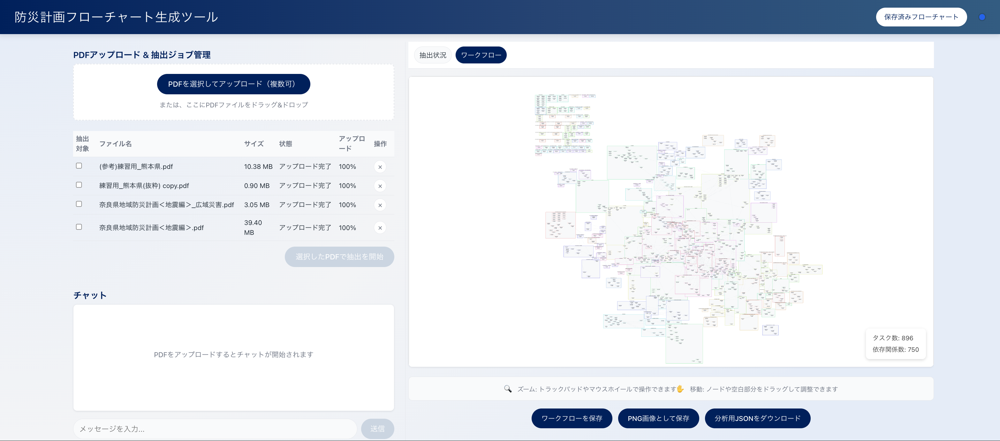

# Disaster Management Workflow Extraction System

## システム概要



## 概要
PDF資料から防災計画のワークフローを抽出し、可視化するシステムです。

## 環境構築

### 必須要件
- Node.js (v18推奨)
- Python (v3.13推奨)
- AWS CLI (設定済みであること)

### セットアップ手順

1. リポジトリのクローン
```bash
git clone https://github.com/koki-asami/disaster-management-workflow-extraction-system.git
cd disaster-management-workflow-extraction-system
```

2. バックエンドの設定（uv 利用）
```bash
cd backend

# 依存関係のインストール & 仮想環境の作成（.venv）
uv sync
```

**重要: APIキーの設定**
`backend/.chalice/config.json` を開き、`YOUR_OPENAI_API_KEY_HERE` の部分をご自身の OpenAI API キーに書き換えてください。

```json
"environment_variables": {
  "OPENAI_API_KEY": "sk-...", 
  "FLOWCHART_TABLE_NAME": "flowcharts_dev"
}
```

3. フロントエンドの設定
```bash
cd ../frontend
npm install
```

### 実行方法

1. バックエンドの起動（別ターミナルで, uv 利用）
```bash
cd backend
uv run chalice local --port 8081 --no-autoreload
```

バックエンドの `/analyze_pdf` エンドポイントは、アップロードされた PDF（複数可）から
LLM を用いて災害対応タスクとタスク間の依存関係を抽出し、次のような JSON を返します:

```json
{
  "tasks": [
    {
      "id": "t001",
      "name": "避難所開設",
      "department": "防災課",
      "description": "避難所の鍵の確保と設備点検を行う…",
      "category": "避難所運営",
      "source_pdf": "A市地域防災計画.pdf"
    }
  ],
  "dependencies": [
    {
      "from": "t001",
      "to": "t010",
      "reason": "資機材準備完了後に実施"
    }
  ]
}
```

2. フロントエンドの起動（別ターミナルで）
```bash
cd frontend
npm start
```

ブラウザで `http://localhost:3000` にアクセスしてください。
