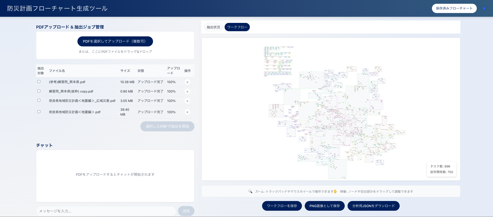

# Disaster Management Workflow Extraction System

## システム概要



## 概要
PDF資料から防災計画のワークフローを抽出し、タスク間の依存関係を可視化・分析するシステムです。
抽出結果は JSON v2 として、原子的な詳細タスク、依存関係、分類・正規化情報、品質診断結果を保持します。

## 主な機能

- PDF から災害対応タスクと依存関係を抽出
- 抽出結果を `フェーズ × 業務テーマ` の大項目ビューで可視化
- 大項目ノードをクリックして、詳細タスクの依存関係と担当レーンを表示
- 依存エッジをクリックして、集約前の詳細依存を確認
- MECE・表記ゆれ・担当主体の曖昧さなどを `/api/v1/plan/diagnose` で診断
- v1 形式の `{ tasks, dependencies }` も読み込み、表示時に分類情報を補完
- 大きな計画書でも OpenAI Batch の依存抽出ペイロードを圧縮し、コンテキスト長超過を抑制

## 抽出 JSON v2

抽出 API の結果は `schema_version: "2.0"` を含む JSON です。`tasks` は詳細タスクを主データとして保持し、可視化側で大項目へ集約します。

```json
{
  "schema_version": "2.0",
  "tasks": [
    {
      "id": "t001",
      "name": "避難所の開設準備を行う",
      "canonical_name": "避難所開設準備",
      "phase": "initial_response",
      "workstream": "evacuation",
      "actor": {
        "org_level": "municipality",
        "org_name_raw": "市町村",
        "org_name_normalized": "市町村",
        "department_raw": "防災担当課",
        "department_normalized": "防災担当課"
      },
      "action": "open",
      "object": "避難所",
      "scope": "指定避難所の鍵、設備、受入体制を確認する",
      "aliases": ["避難所開設", "避難場所開設"],
      "analysis_keys": {
        "duplicate_key": "避難所開設準備",
        "mece_axis": "evacuation",
        "owner_key": "municipality:防災担当課"
      },
      "source_pdf": "地域防災計画.pdf"
    }
  ],
  "dependencies": [
    {
      "from": "t001",
      "to": "t010",
      "reason": "避難所の開設後に避難者を受け入れる",
      "dependency_type": "precondition",
      "confidence": "high"
    }
  ],
  "taxonomies": {
    "phases": [],
    "workstreams": [],
    "org_levels": []
  },
  "quality_findings": []
}
```

### 可視化の考え方

- 初期表示は `phase × workstream` の集約ノードのみを表示します。
- 詳細タスク間の依存は、集約ノード間のエッジへ畳み込みます。
- 集約エッジには元の詳細依存リストを保持します。
- 詳細ビューでは `県 / 市町村 / 国 / 関係機関 / その他` の順で担当レーンを並べます。
- `奈良県`、`県`、`県庁` は `県`、市町村系は `市町村` として正規化します。
- 通常時の依存エッジはグレー表示で、選択・ホバー中のノードに関係するエッジだけを強調します。

## 環境構築

### 必須要件
- Node.js（v20 推奨・CI と一致）
- Python（3.9 以上; Docker イメージは 3.11）
- Docker（本番用イメージのビルド・ECR 利用時）
- AWS CLI（デプロイ・検証時）

### セットアップ手順

1. リポジトリのクローン
```bash
git clone https://github.com/koki-asami/disaster-management-workflow-extraction-system.git
cd disaster-management-workflow-extraction-system
```

2. バックエンドの設定（uv 利用）
```bash
cd backend

# 依存関係のインストール & 仮想環境の作成（.venv）
uv sync
```

**重要: API キーとテーブル名**

Chalice は使いません。`backend` 直下に `.env` を作成し、少なくとも次を設定してください（変数名は [docs/ENV_MAPPING.md](docs/ENV_MAPPING.md) も参照）。

```bash
OPENAI_API_KEY=sk-...
FLOWCHART_TABLE_NAME=flowcharts_dev
AUTH_DISABLED=true
# 任意: S3_BUCKET_NAME=...（未設定時はコード側デフォルト）
```

ローカル開発では `AUTH_DISABLED=true` を指定すると認証を省略できます。本番では Cognito または `API_KEYS` を設定してください。

3. フロントエンドの設定
```bash
cd ../frontend
npm install
```

### 実行方法

1. バックエンドの起動（別ターミナル）
```bash
cd backend
uv run uvicorn dmwe_api.main:app --reload --host 0.0.0.0 --port 8000
```

- ヘルスチェック: `GET http://127.0.0.1:8000/health`
- アプリ API: `http://127.0.0.1:8000/api/v1/...`（例: 同期解析 `POST /api/v1/analyze_pdf`）

主な API:

- `POST /api/v1/uploads/presign`: PDF アップロード用の署名 URL を発行
- `POST /api/v1/uploads/complete`: アップロード完了を登録
- `POST /api/v1/extractions`: アップロード済み PDF から非同期抽出ジョブを作成
- `GET /api/v1/extractions/{job_id}`: 抽出ジョブの進捗と結果を取得
- `POST /api/v1/extractions/{job_id}/cancel`: 抽出ジョブをキャンセル
- `POST /api/v1/analyze_pdf`: 後方互換用の同期解析 API
- `POST /api/v1/plan/diagnose`: 抽出済み JSON の品質診断

2. フロントエンドの起動（別ターミナル）
```bash
cd frontend
npm run dev
```

Vite のデフォルトでは `http://localhost:5173` です。API は開発時プロキシで `http://127.0.0.1:8000` に届きます（`vite.config.mjs` の `/api`・`/health`）。

### テスト・ビルド

```bash
# バックエンド
cd backend
PYTHONPATH=. uv run pytest tests -q

# フロントエンド
cd ../frontend
npm test -- --run
npm run build
```

## AWS へのデプロイ

本システムを AWS 上に dev・prod として載せる場合の典型的な構成は次のとおりです。

- **バックエンド**: `backend/Dockerfile` でビルドしたコンテナを **ECR** に push し、**ECS（Fargate）・App Runner** などで `uvicorn dmwe_api.main:app` を起動
- **非同期ワーカー**（任意）: SQS トリガーの Lambda でハンドラ **`worker_handler.handler`**（[backend/worker_handler.py](backend/worker_handler.py)）
- **フロントエンド**: **S3 + CloudFront**（ビルド成果物は Vite の **`frontend/dist`**）

詳細手順・GitHub Actions・変数一覧:

- **[docs/DEPLOYMENT.md](docs/DEPLOYMENT.md)** — 手動デプロイと CI/CD
- **[docs/AWS_RESOURCES.md](docs/AWS_RESOURCES.md)** — AWS リソースの整理
- **[docs/ENV_MAPPING.md](docs/ENV_MAPPING.md)** — 環境変数・dev/prod 対応

GitHub Actions の [`.github/workflows/deploy.yml`](.github/workflows/deploy.yml) は **ECR へ API イメージを push** し、**フロントを `frontend/dist` から S3 同期**します。フロントのビルドにはリポジトリ Variables の **`BACKEND_API_URL_DEV` / `BACKEND_API_URL_PROD`**（API のパブリックオリジン、末尾スラッシュなし）が必要です。
