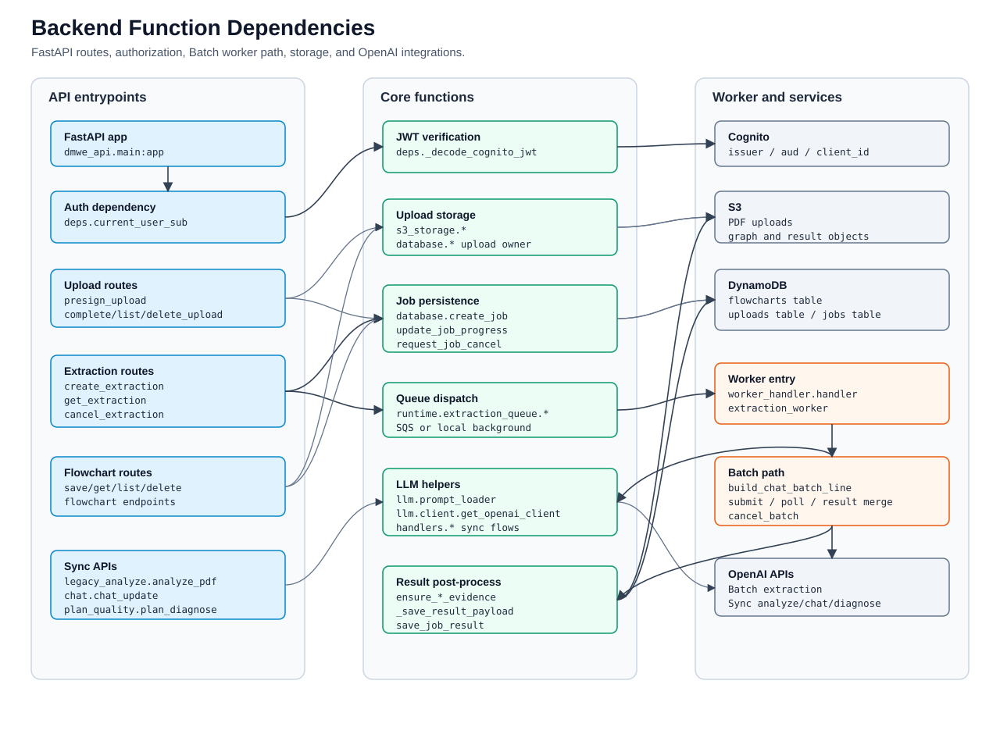

# 環境構築（uv 利用）
```bash
$ cd backend
$ uv sync  # .venv を自動作成して依存関係をインストール
```
# 環境変数の設定

`backend` 直下に `.env` を作成し、[docs/ENV_MAPPING.md](../docs/ENV_MAPPING.md) に沿って少なくとも `OPENAI_API_KEY` と `FLOWCHART_TABLE_NAME` を設定してください。保存済みフローチャートの S3 退避オブジェクトは、環境変数未指定時 **`saved-flowcharts/v2/<location_name>/charts` および `.../graph_data`** に書き込まれます（`FLOWCHART_S3_ROOT` で変更可／空で従来キーに戻す）。

```bash
OPENAI_API_KEY=sk-...

# 任意: 利用するモデルを上書き（デフォルトは gpt-5.2）
TASK_EXTRACTION_MODEL=gpt-5.2
DEPENDENCY_EXTRACTION_MODEL=gpt-5.2
CHAT_MODEL=gpt-5.2

# 本番標準は OpenAI Batch。ローカル smoke では sync に切り替え可。
EXTRACTION_MODE=batch

# 認証を有効にする場合
COGNITO_REGION=ap-northeast-1
COGNITO_USER_POOL_ID=ap-northeast-1_xxxxx
COGNITO_APP_CLIENT_ID=xxxxxxxxxxxxxxxxxxxxxxxxxx
```

# 実行（FastAPI / uvicorn）
```bash
$ uv run uvicorn dmwe_api.main:app --reload --port 8000
```

API は `http://127.0.0.1:8000`、ヘルスチェックは `GET /health`、アプリ API は `/api/v1` 以下です。

## 関数単位の依存関係

下図が主要リクエストの関数呼び出し単位の依存関係です。SVG を画像として埋め込んでおり、色・線・文字は **CSS クラスではなく要素の描画属性** に書いているため、GitHub や厳しく SVG を扱う Markdown プレビューでも崩れにくく表示されます。図の下に検索用の対応表も残しています。



### API エントリポイント

| 起点 | 呼び出し先 | 役割 |
| --- | --- | --- |
| `dmwe_api.main:app` | `deps.current_user_sub` -> `deps._decode_cognito_jwt` | Cognito/API key/dev bypass 認証 |
| `routers.uploads.presign_upload` | `s3_storage.create_presigned_upload_url`, `database.create_upload_record` | S3 upload URL 発行・upload record 作成 |
| `routers.uploads.complete_upload` | `database.mark_upload_complete` | upload 完了登録 |
| `routers.uploads.list_uploads_endpoint` | `database.list_uploads` | login user の upload 一覧取得 |
| `routers.uploads.delete_upload` | `database.get_upload`, `s3_storage.delete_object`, `database.delete_upload_record` | upload 実体・record 削除 |
| `routers.extractions.create_extraction` | `database.get_upload`, `database.create_job`, `database.update_job_progress`, `runtime.extraction_queue.is_running_in_lambda`, `invoke_worker_locally`, `sqs_client.send_message` | upload owner 検証・抽出ジョブ作成・worker 起動 |
| `routers.extractions.get_extraction` | `database.get_job`, `_job_to_response` | job owner 検証・status/result 返却 |
| `routers.extractions.cancel_extraction` | `database.request_job_cancel` -> `llm.batch_client.cancel_batch` | cancel request 保存・OpenAI Batch cancel |
| `routers.flowcharts` | `database.save_flowchart`, `database.get_flowchart`, `database.list_flowcharts`, `database.delete_flowchart` | 保存済み workflow CRUD |
| `routers.legacy_analyze.analyze_pdf` | `handlers.analyze_pdf_sync.run_analyze_pdf` | 同期 PDF 解析 |
| `routers.chat.chat_update` | `handlers.chat.handle_chat_update` | 同期 chat update |
| `routers.plan_quality.plan_diagnose` | `llm.prompt_loader.load_prompt`, `llm.client.get_openai_client` | 同期 plan 診断 |

### 非同期抽出ワーカー

| 起点 | 呼び出し先 | 役割 |
| --- | --- | --- |
| `worker_handler.handler` | `pdf_extraction_worker.extraction_worker` | Lambda worker entrypoint |
| `runtime.extraction_queue.invoke_worker_locally` | `pdf_extraction_worker.extraction_worker` | local uvicorn fallback |
| `extraction_worker` common path | `llm.client.get_openai_client`, `pdf_text.extract_text_by_page_from_s3`, `database.update_job_progress`, `consume_cancel_if_requested` | PDF text extraction・進捗更新・cancel 確認 |
| `EXTRACTION_MODE=batch` | `_run_batch_extraction_and_save` | production default extraction path |
| `_run_batch_extraction_and_save` | `build_chat_batch_line`, `submit_jsonl_batch`, `_poll_batch_until_done`, `download_file_text`, `parse_chat_batch_output` | OpenAI Batch submit / poll / result parse |
| `_poll_batch_until_done` | `get_batch_status`, `normalize_openai_batch_status` | OpenAI Batch status を job status に正規化 |
| batch result post-process | `ensure_task_evidence`, `ensure_dependency_evidence`, `_save_result_payload` | evidence 補完・結果保存 |
| `_save_result_payload` | `s3_client.put_object`, `database.save_job_result`, `database.update_job_progress` | S3 result 保存・job completed 更新 |
| `EXTRACTION_MODE=sync` | `completion_parse_json_with_retry`, `task_extraction_model`, `dependency_extraction_model` | local smoke/emergency fallback |

### 同期 API と保存済みワークフロー

| API 関数 | 主な依存関数 |
| --- | --- |
| `legacy_analyze.analyze_pdf` | `handlers.analyze_pdf_sync.run_analyze_pdf`, `get_openai_client`, `parse_json_response`, evidence helpers |
| `chat.chat_update` | `handlers.chat.handle_chat_update`, `load_prompt(chat_update)`, `get_openai_client` |
| `plan_quality.plan_diagnose` | `load_prompt(plan_diagnose)`, `get_openai_client`, `parse_json_response` |
| `save_flowchart_endpoint` | `database.save_flowchart`, `upload_chart_code`, `upload_graph_data` |
| `get_flowchart_endpoint` | `database.get_flowchart`, `get_chart_code`, `get_graph_data` |
| `list_flowcharts_endpoint` | `database.list_flowcharts` |
| `delete_flowchart_endpoint` | `database.delete_flowchart` |

### AWS へのデプロイ

本番は **コンテナ（`Dockerfile`）を ECR に push し、ECS / App Runner 等で `uvicorn dmwe_api.main:app` を起動**する想定です。GitHub Actions の `deploy.yml` は API イメージの ECR プッシュとフロントの S3 同期を行います。

SQS 連携ワーカー用 Lambda のハンドラは **`worker_handler.handler`**（`dmwe_core.workers.pdf_extraction_worker.extraction_worker`）を設定してください。

## AWS 上での非同期ジョブ実行について（未対応のインフラ作業）

このリポジトリには、PDF 抽出処理を非同期に実行するための以下のコンポーネントが実装されています:

- S3 上の PDF をページ単位でテキスト抽出するワーカー Lambda 関数 `extraction_worker`
- DynamoDB テーブル:
  - `FLOWCHART_TABLE_NAME + "_uploads"`（アップロード済み PDF のメタ情報）
  - `FLOWCHART_TABLE_NAME + "_jobs"`（抽出ジョブの状態・進捗・結果）
- SQS メッセージを処理するコード（`dmwe_core.runtime.extraction_queue`、`EXTRACTION_QUEUE_URL`）

ただし、**AWS 上で必要となる以下のインフラリソースは、このリポジトリではまだ作成していません**:

- SQS キュー本体（`EXTRACTION_QUEUE_URL` で参照されるもの）
- 上記 SQS キューをトリガーとする Lambda（`extraction_worker`）のイベント設定
- DynamoDB テーブル（`flowcharts_*_uploads`, `flowcharts_*_jobs`）の本番・ステージング用作成
- S3 バケットと IAM ロール／ポリシー（S3・DynamoDB・SQS へのアクセス権）

したがって、**ローカルの `uvicorn` では同期版 `/api/v1/analyze_pdf` は動作しますが、SQS 経由の非同期ジョブは AWS 側のキュー・ワーカー Lambda の構成が完了するまで実運用できません。**

本番利用時は、別途 IaC（CloudFormation / CDK / Terraform など）や AWS コンソールを用いて、上記リソースを作成・紐づける必要があります。

### ローカル開発時の挙動（SQS なしで動かす）

`POST /extractions` は **実行環境を自動判定**します。

- **ローカル（Lambda 環境変数なし）**では **SQS に enqueue せず**、同一プロセス内で `extraction_worker` をバックグラウンド実行します（レスポンスは `202`）。
- AWS Lambda（本番）では **SQS に enqueue** します（`EXTRACTION_QUEUE_URL` が必須）。

その場合でも `GET /extractions/{job_id}` のポーリングで進捗を追跡できます。
