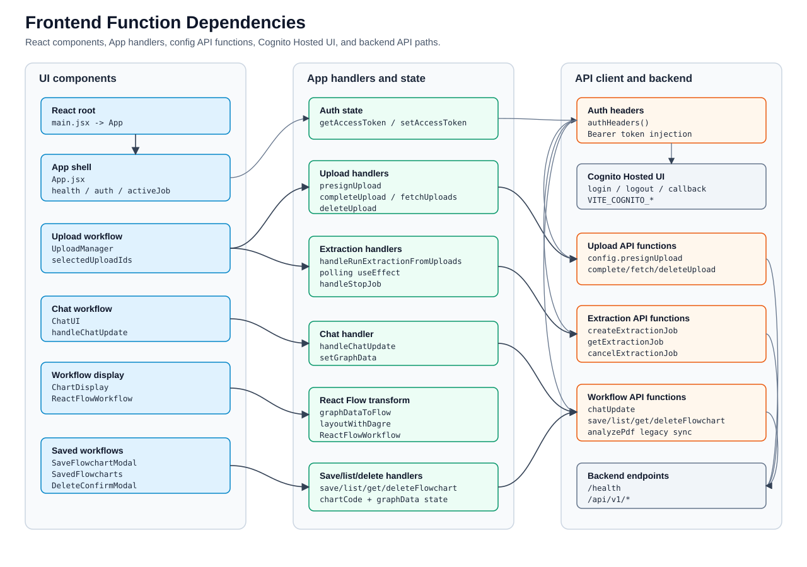

フロントエンド（React + Vite）

## 前提条件

- Node.js 20 推奨（CI と一致）
- バックエンド（FastAPI）がデフォルトでは `http://127.0.0.1:8000` で起動していること（`vite.config.mjs` が `/api` と `/health` をプロキシ）

```bash
node -v
npm -v
```

## 初回セットアップ

```bash
cd frontend
npm install
```

再現性重視なら `npm ci`（`package-lock.json` 必須）。

## 環境変数（API のオリジン・プレフィックス）

Vite では **`VITE_API_ORIGIN`** と **`VITE_API_PREFIX`** を使います（[src/config.js](src/config.js)）。未設定のとき、開発モードではオリジンは空で、上記プロキシ経由で `localhost:8000` に届きます。

本番・手動ビルドの例:

```bash
export VITE_API_ORIGIN=https://api.example.com
export VITE_API_PREFIX=/api/v1
export VITE_COGNITO_DOMAIN=https://your-domain.auth.ap-northeast-1.amazoncognito.com
export VITE_COGNITO_APP_CLIENT_ID=xxxxxxxxxxxxxxxxxxxxxxxxxx
export VITE_COGNITO_REDIRECT_URI=https://app.example.com/
export VITE_COGNITO_LOGOUT_URI=https://app.example.com/
npm run build
```

ローカルで明示したい場合は `frontend/.env.development` や `.env.local` に同じ名前で記述できます。

`VITE_COGNITO_*` が設定されている場合は Cognito Hosted UI のログイン/ログアウトを使います。`VITE_AUTH_DISABLED=true` のときはローカル開発用に認証 UI を無効化できます。

（レガシー）`REACT_APP_*` を `config.js` がフォールバック参照することもあります。

## 開発サーバー

```bash
npm run dev
# または npm start（どちらも vite）
```

既定 URL は **`http://localhost:5173`** です。

## 関数単位の依存関係

下図が主要 UI 操作から API 関数までの依存関係です。SVG を画像として埋め込んでおり、色・線・文字は **CSS クラスではなく要素の描画属性** に書いているため、GitHub や厳しく SVG を扱う Markdown プレビューでも崩れにくく表示されます。図の下に検索用の対応表も残しています。



### 画面コンポーネント

| 起点 | 呼び出し先 | 役割 |
| --- | --- | --- |
| `main.jsx` | `RootErrorBoundary`, `QueryClientProvider`, `App` | React ルート初期化 |
| `App` | `config.checkBackendHealth` | バックエンド疎通確認 |
| `UploadManager` | `config.presignUpload`, `config.completeUpload`, `config.fetchUploads`, `config.deleteUpload` | PDF アップロード管理 |
| `UploadManager` | `App.handleRunExtractionFromUploads` -> `config.createExtractionJob` | 選択 PDF から抽出ジョブ作成 |
| `App polling useEffect` | `config.getExtractionJob` | 抽出ジョブの状態 polling |
| `App.handleStopJob` | `config.cancelExtractionJob` | 抽出ジョブキャンセル |
| `ChatUI` | `App.handleChatUpdate` -> `config.chatUpdate` | チャットによる workflow 更新 |
| `ChartDisplay` | `ReactFlowWorkflow` -> `graphDataToFlow` -> `layoutWithDagre` | 抽出結果を React Flow で表示 |
| `SaveFlowchartModal` | `config.saveFlowchart` | workflow 保存 |
| `SavedFlowcharts` | `config.listFlowcharts`, `config.getFlowchart`, `DeleteConfirmModal` -> `config.deleteFlowchart` | 保存済み workflow の一覧・取得・削除 |

### API クライアント関数

| 起点 | 呼び出し先 | 役割 |
| --- | --- | --- |
| `getAccessToken` / `setAccessToken` | `authHeaders` | Bearer token の保存・送信 |
| `authHeaders` | `analyzePdf`, `chatUpdate`, `presignUpload`, `completeUpload`, `fetchUploads`, `deleteUpload`, `createExtractionJob`, `getExtractionJob`, `cancelExtractionJob`, `saveFlowchart`, `listFlowcharts`, `getFlowchart`, `deleteFlowchart` | 業務 API への認証ヘッダ付与 |
| `API_ENDPOINT = API_ORIGIN + API_PREFIX` | `/api/v1` business API calls | 業務 API のベース URL |
| `API_ORIGIN` | `checkBackendHealth` | `/health` のベース URL |

### 主要 API パス

| config 関数 | Method / path |
| --- | --- |
| `analyzePdf` | `POST /api/v1/analyze_pdf` |
| `chatUpdate` | `POST /api/v1/chat_update` |
| `presignUpload` | `POST /api/v1/uploads/presign` |
| `completeUpload` | `POST /api/v1/uploads/complete` |
| `fetchUploads` | `GET /api/v1/uploads` |
| `deleteUpload` | `DELETE /api/v1/uploads/{upload_id}` |
| `createExtractionJob` | `POST /api/v1/extractions` |
| `getExtractionJob` | `GET /api/v1/extractions/{job_id}` |
| `cancelExtractionJob` | `POST /api/v1/extractions/{job_id}/cancel` |
| `saveFlowchart` | `POST /api/v1/save_flowchart` |
| `listFlowcharts` | `GET /api/v1/list_flowcharts` |
| `getFlowchart` | `GET /api/v1/get_flowchart/{chart_id}` |
| `deleteFlowchart` | `DELETE /api/v1/delete_flowchart/{chart_id}` |
| `checkBackendHealth` | `GET /health` |

### 抽出から表示までの状態遷移

| Step | 関数 / 状態 | 内容 |
| --- | --- | --- |
| 1 | `UploadManager` | PDF 選択 |
| 2 | `presignUpload` | S3 presigned URL 取得 |
| 3 | Browser XHR PUT | S3 に PDF を直接 upload |
| 4 | `completeUpload` | upload 完了を backend に登録 |
| 5 | `fetchUploads` -> `selectedUploadIds` | upload 一覧更新・抽出対象選択 |
| 6 | `createExtractionJob` -> `App.activeJob` | 抽出ジョブ開始 |
| 7 | `getExtractionJob` polling | `queued` / `processing` / `cancelling` は polling 継続 |
| 8 | `completed + result` | `setGraphData(tasks, dependencies)` |
| 9 | `failed` / `cancelled` | polling 停止 |
| 10 | `rightTab = workflow` -> `ChartDisplay` -> `ReactFlowWorkflow` | 結果表示 |

## 本番ビルド

```bash
npm run build
```

成果物は **`frontend/dist`** です（CRA の `build/` ではありません）。

## よくあるトラブル

- バックエンドに繋がらない: バックエンドを `uvicorn dmwe_api.main:app --port 8000` で起動しているか確認する。プロキシを使わず直結する場合は `VITE_API_ORIGIN` をセットしてビルド・起動する。
- ポート競合: `vite.config.mjs` の `server.port` を変更する。
- 依存関係エラー: `rm -rf node_modules && npm install` を試す。

## 主要コマンド

- 開発: `npm run dev`
- ビルド: `npm run build`
- プレビュー: `npm run preview`
- テスト: `npm test`（Vitest）
